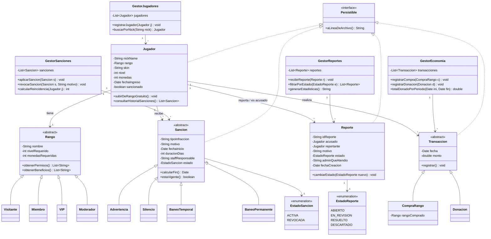

# Diagrama de Clases - Skill Issue Admin

```mermaid
classDiagram
     %%===== JUGADOR Y RANGOS =====
    class Jugador {
        -String nickName
        -Rango rango
        -String skin
        -int nivel
        -int monedas
        -Date fechaIngreso
        -boolean sancionado
        +subirDeRangoGratuito() void
        +consultarHistorialSanciones() List~Sancion~
    }

    class Rango {
        <<abstract>>
        -String nombre
        -int nivelRequerido
        -int monedasRequeridas
        +obtenerPermisos() List~String~
        +obtenerBeneficios() List~String~
    }
    class Visitante
    class Miembro
    class VIP
    class Moderador

    Rango <|-- Visitante
    Rango <|-- Miembro
    Rango <|-- VIP
    Rango <|-- Moderador
    Jugador "1" --> "1" Rango : tiene

     %%===== SANCIONES =====
    class Sancion {
        <<abstract>>
        -String tipoInfraccion
        -String motivo
        -Date fechaInicio
        -int duracionDias
        -String staffResponsable
        -EstadoSancion estado
        +calcularFin() Date
        +estaVigente() boolean
    }
    class Advertencia
    class Silencio
    class BaneoTemporal
    class BaneoPermanente

    Sancion <|-- Advertencia
    Sancion <|-- Silencio
    Sancion <|-- BaneoTemporal
    Sancion <|-- BaneoPermanente

    class EstadoSancion {
        <<enumeration>>
        ACTIVA
        REVOCADA
    }
    Sancion "1" --> "1" EstadoSancion
    Jugador "1" --> "*" Sancion : recibe

     %%===== REPORTES =====
    class Reporte {
        -String idReporte
        -Jugador acusado
        -Jugador reportante
        -String motivo
        -EstadoReporte estado
        -String adminQueAtendio
        -Date fechaCreacion
        +cambiarEstado(EstadoReporte nuevo) void
    }
    class EstadoReporte {
        <<enumeration>>
        ABIERTO
        EN_REVISION
        RESUELTO
        DESCARTADO
    }
    Reporte "1" --> "1" EstadoReporte
    Jugador "1" --> "*" Reporte : reporta / es acusado

     %%===== ECONOMIA =====
    class Transaccion {
        <<abstract>>
        -Date fecha
        -double monto
        +registrar() void
    }
    class CompraRango {
        -Rango rangoComprado
    }
    class Donacion

    Transaccion <|-- CompraRango
    Transaccion <|-- Donacion
    Jugador "1" --> "*" Transaccion : realiza

     %%===== GESTORES (colecciones + logica) =====
    class GestorJugadores {
        -List~Jugador~ jugadores
        +registrarJugador(Jugador j) void
        +buscarPorNick(String nick) Jugador
    }
    class GestorSanciones {
        -List~Sancion~ sanciones
        +aplicarSancion(Sancion s) void
        +revocarSancion(Sancion s, String motivo) void
        +calcularReincidencia(Jugador j) int
    }
    class GestorReportes {
        -List~Reporte~ reportes
        +recibirReporte(Reporte r) void
        +filtrarPorEstado(EstadoReporte e) List~Reporte~
        +generarEstadisticas() String
    }
    class GestorEconomia {
        -List~Transaccion~ transacciones
        +registrarCompra(CompraRango c) void
        +registrarDonacion(Donacion d) void
        +totalDonadoPorPeriodo(Date ini, Date fin) double
    }

    GestorJugadores "1" --> "*" Jugador
    GestorSanciones "1" --> "*" Sancion
    GestorReportes "1" --> "*" Reporte
    GestorEconomia "1" --> "*" Transaccion

     %%===== PERSISTENCIA (propuesta para RNF-01) =====
    class Persistible {
        <<interface>>
        +aLineaDeArchivo() String
    }
    Persistible <|.. Jugador
    Persistible <|.. Sancion
    Persistible <|.. Reporte
    Persistible <|.. Transaccion
```
