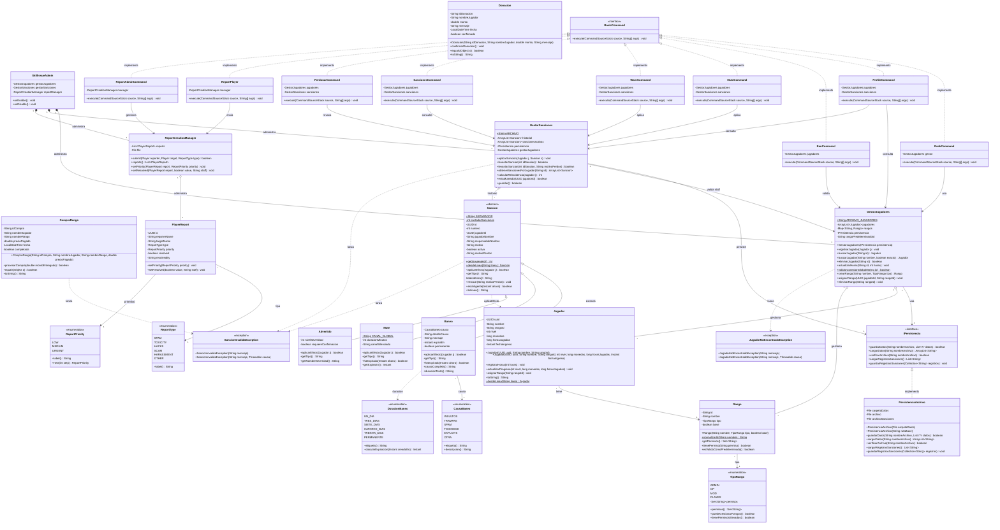

```mermaid
classDiagram
    direction TB

    %% ===== PERSISTENCIA (ARCHIVOS PLANOS E INTERFAZ) =====
    class IPersistencia {
        <<interface>>
        +guardarDatos(String nombreArchivo, List~?~ datos) boolean
        +cargarDatos(String nombreArchivo) ArrayList~String~
        +verificarArchivo(String nombreArchivo) boolean
        +cargarRegistrosSanciones() List~String~
        +guardarRegistrosSanciones(Collection~String~ registros) void
    }

    class PersistenciaArchivo {
        -File carpetaDatos
        -File archivo
        -File archivoSanciones
        +PersistenciaArchivo(File carpetaDatos)
        +PersistenciaArchivo(String rutaBase)
        +guardarDatos(String nombreArchivo, List~?~ datos) boolean
        +cargarDatos(String nombreArchivo) ArrayList~String~
        +verificarArchivo(String nombreArchivo) boolean
        +cargarRegistrosSanciones() List~String~
        +guardarRegistrosSanciones(Collection~String~ registros) void
    }

    IPersistencia <|.. PersistenciaArchivo : implements

    %% ===== NUCLEO, JUGADORES, RANGOS Y ECONOMIA =====
    class SkillIssueAdmin {
        -GestorJugadores gestorJugadores
        -GestorSanciones gestorSanciones
        -ReportCreationManager reportManager
        +onEnable() void
        +onDisable() void
    }

    class Jugador {
        -UUID uuid
        -String nombre
        -String rangoId
        -int nivel
        -long monedas
        -long horasJugadas
        -Instant fechaIngreso
        +Jugador(UUID uuid, String nombre, String rangoId)
        +Jugador(UUID uuid, String nombre, String rangoId, int nivel, long monedas, long horasJugadas, Instant fechaIngreso)
        +registrarHoras(int horas) void
        +actualizarProgreso(int nivel, long monedas, long horasJugadas) void
        +asignarRango(String rangoId) void
        +toString() String
        +desdeLinea(String linea)$ Jugador
    }

    class Rango {
        -String id
        -String nombre
        -TipoRango tipo
        -boolean base
        +Rango(String nombre, TipoRango tipo, boolean base)
        +normalizarId(String nombre)$ String
        +getPermisos() Set~String~
        +tienePermiso(String permiso) boolean
        +esValidoComoPredeterminado() boolean
    }

    class TipoRango {
        <<enumeration>>
        ADMIN
        OP
        MOD
        PLAYER
        -Set~String~ permisos
        +permisos() Set~String~
        +puedeGestionarRangos() boolean
        +tienePermisosElevados() boolean
    }

    class CompraRango {
        -String idCompra
        -String nombreJugador
        -String nombreRango
        -double precioPagado
        -LocalDateTime fecha
        -boolean completada
        +CompraRango(String idCompra, String nombreJugador, String nombreRango, double precioPagado)
        +procesarCompra(double montoEntregado) boolean
        +equals(Object o) boolean
        +toString() String
    }

    class Donacion {
        -String idDonacion
        -String nombreJugador
        -double monto
        -String mensaje
        -LocalDateTime fecha
        -boolean confirmada
        +Donacion(String idDonacion, String nombreJugador, double monto, String mensaje)
        +confirmarDonacion() void
        +equals(Object o) boolean
        +toString() String
    }

    Jugador "*" --> "1" Rango : tiene
    Rango "*" --> "1" TipoRango : tipo

    %% ===== SANCIONES (HERENCIA Y POLIMORFISMO) =====
    class Sancion {
        <<abstract>>
        +String SEPARADOR$
        -int contadorSanciones$
        -UUID id
        -int numero
        -UUID jugadorId
        -String jugadorNombre
        -String responsableNombre
        -String motivo
        -boolean activa
        -String motivoPerdon
        +getSiguienteId()$ int
        +desdeLinea(String linea)$ Sancion
        +aplicarEfecto(Jugador j)* boolean
        +getTipo()* String
        #datosExtra()* String
        +revocar(String motivoPerdon) void
        +estaVigente(Instant ahora) boolean
        +toLinea() String
    }

    class Baneo {
        -CausaBaneo causa
        -String detalleCausa
        -String mensaje
        -Instant expiraEn
        -boolean permanente
        +aplicarEfecto(Jugador j) boolean
        +getTipo() String
        +haExpirado(Instant ahora) boolean
        +causaCompleta() String
        +duracionTexto() String
    }

    class Mute {
        +String CANAL_GLOBAL$
        -int duracionMinutos
        -String canalSilenciado
        +aplicarEfecto(Jugador j) boolean
        +getTipo() String
        +haExpirado(Instant ahora) boolean
        +getExpiraEn() Instant
    }

    class Advertido {
        -int nivelSeveridad
        -boolean requiereConfirmacion
        +aplicarEfecto(Jugador j) boolean
        +getTipo() String
        +getNombreSeveridad() String
    }

    class CausaBaneo {
        <<enumeration>>
        INSULTOS
        TRAMPAS
        SPAM
        TOXICIDAD
        EXPLOITS
        OTRA
        +etiqueta() String
        +descripcion() String
    }

    class DuracionBaneo {
        <<enumeration>>
        UN_DIA
        TRES_DIAS
        SIETE_DIAS
        CATORCE_DIAS
        TREINTA_DIAS
        PERMANENTE
        +etiqueta() String
        +calcularExpiracion(Instant creadoEn) Instant
    }

    Sancion <|-- Baneo : extends
    Sancion <|-- Mute : extends
    Sancion <|-- Advertido : extends
    Baneo "*" --> "1" CausaBaneo : causa
    Baneo ..> DuracionBaneo : duracion
    Sancion ..> Jugador : aplicaEfecto

    %% ===== REPORTES =====
    class PlayerReport {
        -UUID id
        -String reporterName
        -String targetName
        -ReportType type
        -ReportPriority priority
        -boolean resolved
        -String resolvedBy
        +setPriority(ReportPriority priority) void
        +setResolved(boolean value, String staff) void
    }

    class ReportType {
        <<enumeration>>
        SPAM
        TOXICITY
        HACKS
        SCAM
        HARASSMENT
        OTHER
        +label() String
    }

    class ReportPriority {
        <<enumeration>>
        LOW
        MEDIUM
        URGENT
        +label() String
        +next(int step) ReportPriority
    }

    PlayerReport "*" --> "1" ReportType : tipo
    PlayerReport "*" --> "1" ReportPriority : prioridad

    %% ===== GESTORES DEL SISTEMA =====
    class GestorJugadores {
        +String ARCHIVO_JUGADORES$
        -ArrayList~Jugador~ jugadores
        -Map~String, Rango~ rangos
        -IPersistencia persistencia
        -String rangoPredeterminadoId
        +GestorJugadores(IPersistencia persistencia)
        +registrarJugador(Jugador j) void
        +buscarJugador(String id) Jugador
        +buscarJugador(String nombre, boolean exacto) Jugador
        +eliminarJugador(String id) boolean
        +actualizarHoras(String id, int horas) void
        +validarConexionGlobal(String ip)$ boolean
        +crearRango(String nombre, TipoRango tipo) Rango
        +asignarRango(UUID jugadorId, String rangoId) void
        +eliminarRango(String rangoId) void
    }

    class GestorSanciones {
        +String ARCHIVO$
        -ArrayList~Sancion~ historial
        -ArrayList~Sancion~ sancionesActivas
        -IPersistencia persistencia
        -GestorJugadores gestorJugadores
        +aplicarSancion(Jugador j, Sancion s) void
        +levantarSancion(int idSancion) boolean
        +levantarSancion(int idSancion, String motivoPerdon) boolean
        +obtenerSancionesPorJugador(String id) ArrayList~Sancion~
        +calcularReincidencia(Jugador j) int
        +estaMuteado(UUID jugadorId) boolean
        +guardar() boolean
    }

    class ReportCreationManager {
        -List~PlayerReport~ reports
        -File file
        +submit(Player reporter, Player target, ReportType type) boolean
        +reports() List~PlayerReport~
        +setPriority(PlayerReport report, ReportPriority priority) void
        +setResolved(PlayerReport report, boolean value, String staff) void
    }

    SkillIssueAdmin "1" *-- "1" GestorJugadores : administra
    SkillIssueAdmin "1" *-- "1" GestorSanciones : administra
    SkillIssueAdmin "1" *-- "1" ReportCreationManager : administra
    GestorJugadores "1" --> "1" IPersistencia : usa
    GestorJugadores "1" o-- "*" Jugador : gestiona
    GestorJugadores "1" o-- "*" Rango : gestiona
    GestorSanciones "1" --> "1" IPersistencia : persiste
    GestorSanciones --> GestorJugadores : valida staff
    GestorSanciones "1" o-- "*" Sancion : historial
    ReportCreationManager "1" o-- "*" PlayerReport : administra

    %% ===== EXCEPCIONES PERSONALIZADAS =====
    class JugadorNoEncontradoException {
        <<exception>>
        +JugadorNoEncontradoException(String mensaje)
        +JugadorNoEncontradoException(String mensaje, Throwable causa)
    }

    class SancionInvalidaException {
        <<exception>>
        +SancionInvalidaException(String mensaje)
        +SancionInvalidaException(String mensaje, Throwable causa)
    }

    GestorJugadores ..> JugadorNoEncontradoException : lanza
    Sancion ..> SancionInvalidaException : lanza
    GestorSanciones ..> SancionInvalidaException : lanza
    CompraRango ..> SancionInvalidaException : lanza

    %% ===== CAPA DE COMANDOS (POLIMORFISMO) =====
    class BasicCommand {
        <<interface>>
        +execute(CommandSourceStack source, String[] args) void
    }

    class RankCommand {
        -GestorJugadores gestor
        +execute(CommandSourceStack source, String[] args) void
    }

    class ProfileCommand {
        -GestorJugadores jugadores
        -GestorSanciones sanciones
        +execute(CommandSourceStack source, String[] args) void
    }

    class BanCommand {
        -GestorJugadores jugadores
        +execute(CommandSourceStack source, String[] args) void
    }

    class MuteCommand {
        -GestorJugadores jugadores
        -GestorSanciones sanciones
        +execute(CommandSourceStack source, String[] args) void
    }

    class WarnCommand {
        -GestorJugadores jugadores
        -GestorSanciones sanciones
        +execute(CommandSourceStack source, String[] args) void
    }

    class SancionesCommand {
        -GestorJugadores jugadores
        -GestorSanciones sanciones
        +execute(CommandSourceStack source, String[] args) void
    }

    class PerdonarCommand {
        -GestorJugadores jugadores
        -GestorSanciones sanciones
        +execute(CommandSourceStack source, String[] args) void
    }

    class ReportPlayer {
        -ReportCreationManager manager
        +execute(CommandSourceStack source, String[] args) void
    }

    class ReportAdminCommand {
        -ReportCreationManager manager
        +execute(CommandSourceStack source, String[] args) void
    }

    BasicCommand <|.. RankCommand : implements
    BasicCommand <|.. ProfileCommand : implements
    BasicCommand <|.. BanCommand : implements
    BasicCommand <|.. MuteCommand : implements
    BasicCommand <|.. WarnCommand : implements
    BasicCommand <|.. SancionesCommand : implements
    BasicCommand <|.. PerdonarCommand : implements
    BasicCommand <|.. ReportPlayer : implements
    BasicCommand <|.. ReportAdminCommand : implements

    RankCommand --> GestorJugadores : usa
    ProfileCommand --> GestorJugadores : consulta
    ProfileCommand --> GestorSanciones : consulta
    BanCommand --> GestorJugadores : valida
    MuteCommand --> GestorSanciones : aplica
    WarnCommand --> GestorSanciones : aplica
    SancionesCommand --> GestorSanciones : consulta
    PerdonarCommand --> GestorSanciones : revoca
    ReportPlayer --> ReportCreationManager : envia
    ReportAdminCommand --> ReportCreationManager : gestiona
```
